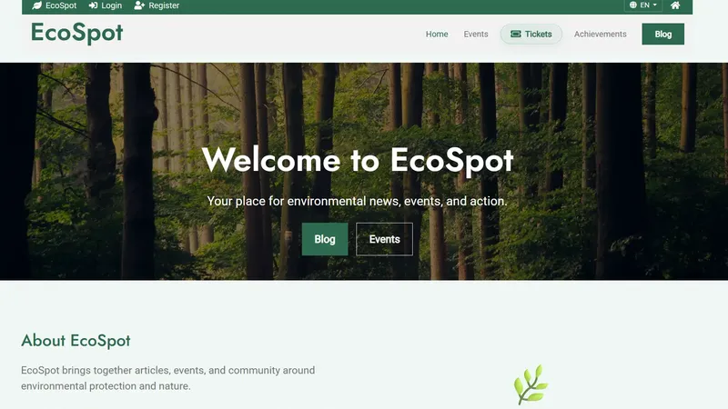
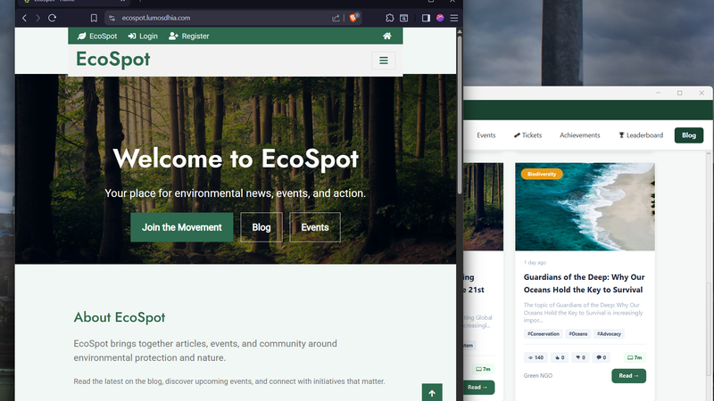
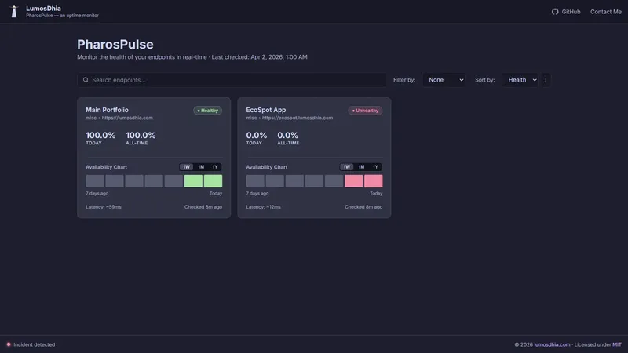
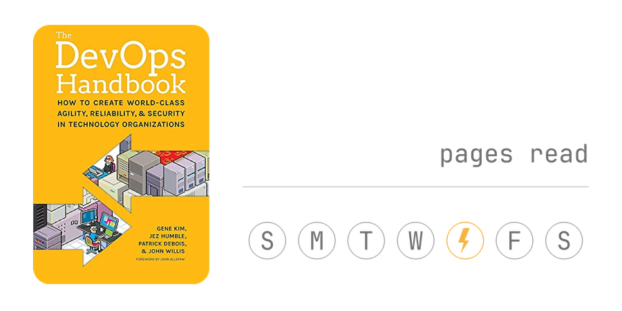
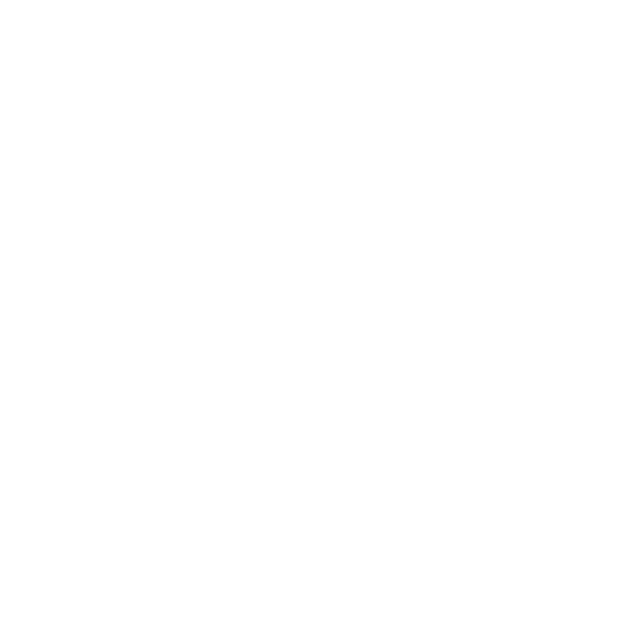

<p align="center">

</p>


<p>
 

```
LumosDhia@github
-------------------------
🏫 ESPRIT
📜 Bachelor's in IT (Honors), now doing a Master's in CS
🌱 Learning K8S 
💫 Python, Java, Bash 
⛰️ Hicking / Swimming
📷 Photography / Reading
```
</p>

<br clear="both">


<h2 align="center"> 🇹‌🇪‌🇨‌🇭‌ 🇸‌🇹‌🇦‌🇨‌🇰‌ </h2>

<table align="center">
  <tr>
    <td valign="middle"><b>💻 Languages</b></td>
    <td valign="middle">
      
      
      
    </td>
    <td valign="middle"><b>☁️ Cloud</b></td>
    <td valign="middle">
      
      
      
    </td>
  </tr>
</table>

<table align="center">
  <tr>
    <td valign="middle"><b>⚙️ DevOps / Infra</b></td>
    <td valign="middle">
      
      
      
      
      
      
      
      
      
    </td>
  </tr>
</table>


<!---
HackMD section (disabled — I don't have a HackMD account set up yet).

How it works: .github/workflows/update-hackmd.yml runs the
pipi-bear/hackmd-readme-stats action, which reads page-view counts and the
titles of most-viewed/most-recently-updated public notes for whichever
hackmd_user is set in that workflow, then rewrites the plain text between
the START_SECTION:hackmd/END_SECTION:hackmd markers below and commits it
back — same pattern as the waka-readme and hardcover-readme widgets
elsewhere in this file. Its triggers are currently removed so it never
runs. To turn it back on: create a HackMD account, set hackmd_user to my
own username in the workflow file, and re-add a schedule/workflow_dispatch
trigger.

<h2 align="center"> 🇭‌🇦‌🇨‌🇰‌🇲‌🇩‌ </h2>
<!--START_SECTION:hackmd-->
<!--END_SECTION:hackmd-->

<h2 align="center"> 🇵‌🇷‌🇴‌🇯‌🇪‌🇨‌🇹‌🇸‌ </h2>
<table align="center" cellpadding="10" cellspacing="0">
  <tr>
    <td align="center" valign="top">
      <b>ShutterSage-AI</b><br><br>
      <a href="https://github.com/LumosDhia/ShutterSage-AI"></a><br><br>
      <a href="https://github.com/LumosDhia/ShutterSage-AI"></a>
    </td>
    <td align="center" valign="top">
      <b>EcoSpot Web</b><br><br>
      <a href="https://github.com/LumosDhia/EcoSpot-Web"></a><br><br>
      <a href="https://github.com/LumosDhia/EcoSpot-Web"></a>
    </td>
  </tr>
  <tr>
    <td align="center" valign="top">
      <b>EcoSpot Desktop</b><br><br>
      <a href="https://github.com/LumosDhia/Ecospot-Java"></a><br><br>
      <a href="https://github.com/LumosDhia/Ecospot-Java"></a>
    </td>
    <td align="center" valign="top">
      <b>PharosPulse</b><br><br>
      <a href="https://github.com/LumosDhia/PharosPulse"></a><br><br>
      <a href="https://github.com/LumosDhia/PharosPulse"></a>
      <a href="https://status.lumosdhia.com/"></a>
    </td>
  </tr>
</table>


<h2 align="center"> 🇨‌🇴‌🇳‌🇹‌🇦‌🇨‌🇹‌ 🇲‌🇪‌ </h2>
<div align="center">
  
</div>

<p align="center">
<a href="mailto:mdhiaaouina@outlook.com" target="_blank">
  
</a>
<a href="https://www.instagram.com/lumosdhia/" target="_blank">
  
</a>
<a href="https://unsplash.com/@lumosdhia" target="_blank">
  
</a>
</p>
<p align="center">
<a href="https://www.linkedin.com/in/mdhia-lumosdhia/" target="_blank">
  
</a>
</p>

<!--START_SECTION:reading-->
<p align="center"><picture>
  <source media="(prefers-color-scheme: dark)" srcset="assets/reading_card_dark.png">
  
</picture></p>
<!--END_SECTION:reading-->
<br clear="both">

<!---
Waka Readme Stats

How it works: .github/workflows/waka-readme.yml runs anmol098/waka-readme-stats
on a schedule (daily at 00:00 UTC, plus manual dispatch). That action reads a
WakaTime API key from the repo secret WAKATIME_API_KEY and a GH_TOKEN secret,
pulls coding-time metrics from my WakaTime account, then rewrites the content
between the START_SECTION:waka/END_SECTION:waka markers below and commits it
back — same pattern as the hackmd and reading widgets elsewhere in this file.
Most optional blocks (short info, profile views, LOC chart, commits, OS,
timezone, editors, per-repo languages, AI code time) are turned off in the
workflow config, leaving mainly the language breakdown chart.
-->
> May your pods never CrashLoopBackOff 

<!--START_SECTION:waka-->


📅 **I'm Most Productive on Tuesday** 

```text
Monday                   115 commits         ██████░░░░░░░░░░░░░░░░░░░   22.55 % 
Tuesday                  119 commits         ██████░░░░░░░░░░░░░░░░░░░   23.33 % 
Wednesday                52 commits          ███░░░░░░░░░░░░░░░░░░░░░░   10.20 % 
Thursday                 30 commits          █░░░░░░░░░░░░░░░░░░░░░░░░   05.88 % 
Friday                   74 commits          ████░░░░░░░░░░░░░░░░░░░░░   14.51 % 
Saturday                 63 commits          ███░░░░░░░░░░░░░░░░░░░░░░   12.35 % 
Sunday                   57 commits          ███░░░░░░░░░░░░░░░░░░░░░░   11.18 % 
```


📊 **This Week I Spent My Time On** 

```text
💬 Programming Languages: 
Markdown                 5 hrs 45 mins       ███████░░░░░░░░░░░░░░░░░░   28.01 % 
Other                    4 hrs 23 mins       █████░░░░░░░░░░░░░░░░░░░░   21.31 % 
Python                   1 hr 41 mins        ██░░░░░░░░░░░░░░░░░░░░░░░   08.21 % 
TypeScript               1 hr 39 mins        ██░░░░░░░░░░░░░░░░░░░░░░░   08.06 % 
Bash                     49 mins             █░░░░░░░░░░░░░░░░░░░░░░░░   04.04 % 

🐱‍💻 Projects: 
LumosDhia                3 hrs 32 mins       ████░░░░░░░░░░░░░░░░░░░░░   17.23 % 
Mvp-Hub                  2 hrs 22 mins       ███░░░░░░░░░░░░░░░░░░░░░░   11.54 % 
cvs                      1 hr 30 mins        ██░░░░░░░░░░░░░░░░░░░░░░░   07.31 % 
campus-pass              1 hr 12 mins        █░░░░░░░░░░░░░░░░░░░░░░░░   05.89 % 
ai-job-search            1 hr 5 mins         █░░░░░░░░░░░░░░░░░░░░░░░░   05.29 % 
```


 Last Updated on 04/09/2026 02:23:08 UTC
<!--END_SECTION:waka-->
